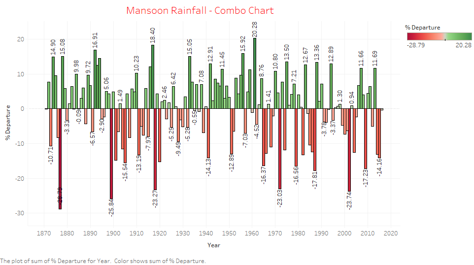

# FORECASTING MONSOON RAINFALL

Let's start building our time series models. At first, we will plot historical trend of monsoon rainfall using `ggplot2` package.

**Plotting Time Series data:**

```{r message=FALSE, warning=FALSE,fig.cap="Historical trend of monsoon rainfall",out.width='75%',fig.align='center'}

 rainfall%>%ggplot(aes(YEAR,JJAS))+geom_line()+
   geom_point(alpha = 0.5, color = palette_light()[[1]], shape=20,size=2) +
    labs(title = "JJAS Rainfall in India", x = "YEAR", y = "JJAS Rainfall",
        subtitle = "data from 1871-2016") +
     theme_tq()

```

**Combo-chart for Annual Rainfall:**

Let's look at some complex visulization for annual rainfall:

```{r message=FALSE, warning=FALSE,fig.cap="Combo chart of monsoon rainfall",out.width='75%',fig.align='center'}
#Calculating Mean for JJAS
JJAS_mean = mean(rainfall$JJAS)

#Calculating percentage departure From Mean for JJAS
rainfall$Perc_departure_JJAS = ((rainfall$JJAS-JJAS_mean)/JJAS_mean)*100

#plotting combo-chart for ANN
rainfall1 <- subset(rainfall, Perc_departure_JJAS>= 0)
rainfall2 <- subset(rainfall, Perc_departure_JJAS < 0)

ggplot() + 
     geom_bar(data = rainfall1, aes(x=YEAR, y=Perc_departure_JJAS),
              stat = "identity",colour = "lightgreen") +
     geom_bar(data = rainfall2, aes(x=YEAR, y=Perc_departure_JJAS),
              stat = "identity",colour = "pink")  + 
  geom_ma(data = rainfall,aes(x= YEAR, y= Perc_departure_JJAS),
          ma_fun = SMA, n = 11, color = "blue",size = 1)
  
```

We can get similar chart using **Tableau** with more effective visulization as shown in below image:




## Model Building

Let's start model building. We are following same process as mentioned in Annual Rainfall chapter.

### ***Splitting into train and test***

```{r message=FALSE, warning=FALSE}

series.end <- floor(0.8*nrow(rainfall)) #select the first 80% of the data
train <- rainfall[1:series.end,] #assign the first 80% of the data to the train set
test <- rainfall[(series.end+1):nrow(rainfall),] #assign the most recent 20% to the test set

```

### ***Converting data into time series***

```{r message=FALSE, warning=FALSE}
# Convert data frame into time serise object

train.ts <- ts(train, start = c(1871), end = c(1986))
test.ts <- ts(test, start = c(1987), end = c(2016))

```


### ***Test Stationary or Non-stationary***

The null hypothesis assumes that the series is non-stationary (mean does not stay constant). ADF procedure tests whether the change in Y can be explained by lagged value and a linear trend. If contribution of the lagged value to the change in Y is non-significant and there is a presence of a trend component, the series is non-stationary and null hypothesis will not be rejected.

```{r message=FALSE, warning=FALSE}

pander(adf.test(train.ts[, 16], alternative = "stationary"))

```

**Interpretation:**

> The monsoon rainfall data is stationary(p-value = 0.01) by the ADF test hence there is no need of differencing the series.
> Since p-value is less then 5%, we can reject null hypothesis. This means that our series is stationary.
 
### ***Forecasts using Exponential Smoothing***

Exponential smoothing is a common method for making short-term forecasts in time series data.

#### _***Simple Exponential Smoothing***_

If we have a time series with constant level and no seasonality, we can use simple exponential smoothing for short term forecasts.

This method is a way of estimating the level at the current time point. Smoothing is controlled by the parameter `alpha` for the estimate of the level at the current time point. The value of alpha lies between 0 and 1. Values of alpha close to 0 mean that little weight is places on the most recent observations when making forecasts of future values.

In **R** we can use the `HoltWinters()` function. For simple exponential smoothing, we need to set the parameters `beta = FALSE` and `gamma = FALSE`.

```{r message=FALSE, warning=FALSE,fig.cap="Forecasted value using simple expontional smoothing for Monsoon Rainfall"}
options("scipen"=100, "digits"=2)
# Simple Exponetial Smoothing
SimpleExpSmooth <- HoltWinters(train.ts[, 16], beta=FALSE, gamma = FALSE)
SimpleExpSmooth

# Plotting the estimates
#plot(SimpleExpSmooth)

train_forecast = as.data.frame(SimpleExpSmooth$fitted)
train_JJAS = train[,c("YEAR", "JJAS")]
train_JJAS = train_JJAS[2:116, ]
train_JJAS = cbind(train_JJAS, train_forecast)
train_JJAS$xhat <- NULL
setnames(train_JJAS, "level", "Forecast")

train_JJAS$Error = (train_JJAS$JJAS - train_JJAS$Forecast)^2
train_JJAS$AbsError = abs(train_JJAS$JJAS - train_JJAS$Forecast)
train_JJAS$APE = abs(train_JJAS$JJAS - train_JJAS$Forecast)/train_JJAS$JJAS

SampleSize = nrow(train_JJAS)
MSE = sum(train_JJAS$Error)/SampleSize
RMSE = sqrt(MSE)
MAE = sum(train_JJAS$AbsError)/SampleSize
MAPE = (sum(train_JJAS$APE)/SampleSize)*100

statistics = c("SampleSize", "MSE", "RMSE", "MAE", "MAPE")
Value = rbind(SampleSize, MSE, RMSE, MAE, MAPE)

train_statistics <- data.frame(cbind(statistics, Value))
train_statistics$training_set <- train_statistics$V2
train_statistics$V2 <- NULL
rownames(train_statistics) <-  NULL

library(forecast)
prediction_SES <- forecast(SimpleExpSmooth, h=30)
plot(prediction_SES)
Forecast = as.data.frame(prediction_SES$mean)

test_JJAS = test[,c("YEAR", "JJAS")]
test_JJAS = cbind(test_JJAS, Forecast)
test_JJAS = data.table(test_JJAS)
setnames(test_JJAS, 'x', 'Forecast')

test_JJAS$Error = (test_JJAS$JJAS - test_JJAS$Forecast)^2
test_JJAS$AbsError = abs(test_JJAS$JJAS - test_JJAS$Forecast)
test_JJAS$APE = abs(test_JJAS$JJAS - test_JJAS$Forecast)/test_JJAS$JJAS
#kable(test_JJAS, "latex",longtable=T,booktabs=T,caption="Simple Exponential Smoothing forecast of test data") %>%
#  kable_styling(latex_options = c("striped", "scale_down"))

SampleSize = nrow(test_JJAS)
MSE = sum(test_JJAS$Error)/SampleSize
RMSE = sqrt(MSE)
MAE = sum(test_JJAS$AbsError)/SampleSize
MAPE = (sum(test_JJAS$APE)/SampleSize)*100

statistics = c("SampleSize", "MSE", "RMSE", "MAE", "MAPE")
Value = rbind(SampleSize, MSE, RMSE, MAE, MAPE)

test_statistics <- data.frame(cbind(statistics, Value))
test_statistics$testing_set <- test_statistics$V2
test_statistics$V2 <- NULL
rownames(test_statistics) <-  NULL

Finalresult_SES = merge(train_statistics, test_statistics, by ="statistics")

kable(Finalresult_SES, "latex",longtable=T,booktabs=T,caption="Accuracy Metrics of Monsoon Rainfall using Simple Exponential Smoothing") %>%
  kable_styling(latex_options = c("striped", "scale_down"))

```

**Interpretation:**

 1.To make forecasts using simple exponential smoothing in R, we can fit a simple exponential smoothing predictive model using the “HoltWinters()” function in R. To use HoltWinters() for simple exponential smoothing, we need to set the parameters beta=FALSE and gamma=FALSE in the HoltWinters() function (the beta and gamma parameters are used for Holt’s exponential smoothing, or Holt-Winters exponential smoothing
 
 2.By default, HoltWinters() just makes forecasts for the same time period covered by our original time series. In this case, our original time series included rainfall for All India from 1871-1986, so the forecasts are also for 1871-1986.
 
 3.The output of HoltWinters() tells us that the estimated value of the alpha parameter is about 0.018. This is very close to zero, telling us that the forecasts are based on both recent and less recent observations (although somewhat more weight is placed on recent observations).
 
 4.Here the forecasts for 1987-2016 are plotted as a blue line, the 80% prediction interval as an sky blue shaded area, and the 95% prediction interval as a grey shaded area.
 
 5.From graph, The plot shows the original time series in black, and the forecasts as a blue line. The time series of forecasts is much smoother than the time series of the original data here.
 
 6. Overall model accuraacy is 92.13% (MAPE = 7.87%) indecating good fit of the model. This model also does not exhibit over-fitting as training and test error are almost same.

#### _***Exponential Smoothing***_

Let's look at performance of Exponential Smoothing Model.

```{r message=FALSE, warning=FALSE,fig.cap="Forecasted value using expontional smoothing for Monsoon Rainfall"}
options("scipen"=100, "digits"=2)
# Exponetial Smoothing
ExpSmooth <- HoltWinters(train.ts[, 16], gamma = FALSE)
ExpSmooth

# Exponetial Smoothing
ExpSmooth <- ets(train.ts[, 16])
ExpSmooth

# Plotting the estimates
#plot(ExpSmooth)

train_forecast = as.data.frame(ExpSmooth$fitted)
train_JJAS = train[,c("YEAR", "JJAS")]
train_JJAS = train_JJAS[1:116, ]
train_JJAS = cbind(train_JJAS, train_forecast)
train_JJAS$xhat <- NULL
setnames(train_JJAS, "x", "Forecast")

train_JJAS$Error = (train_JJAS$JJAS - train_JJAS$Forecast)^2
train_JJAS$AbsError = abs(train_JJAS$JJAS - train_JJAS$Forecast)
train_JJAS$APE = abs(train_JJAS$JJAS - train_JJAS$Forecast)/train_JJAS$JJAS

SampleSize = nrow(train_JJAS)
MSE = sum(train_JJAS$Error)/SampleSize
RMSE = sqrt(MSE)
MAE = sum(train_JJAS$AbsError)/SampleSize
MAPE = (sum(train_JJAS$APE)/SampleSize)*100

statistics = c("SampleSize", "MSE", "RMSE", "MAE", "MAPE")
Value = rbind(SampleSize, MSE, RMSE, MAE, MAPE)

train_statistics <- data.frame(cbind(statistics, Value))
train_statistics$training_set <- train_statistics$V2
train_statistics$V2 <- NULL
rownames(train_statistics) <-  NULL

library(forecast)
prediction_SES <- forecast(ExpSmooth, h=30)
plot(prediction_SES)
Forecast = as.data.frame(prediction_SES$mean)

test_JJAS = test[,c("YEAR", "JJAS")]
test_JJAS = cbind(test_JJAS, Forecast)
test_JJAS = data.table(test_JJAS)
setnames(test_JJAS, 'x', 'Forecast')

test_JJAS$Error = (test_JJAS$JJAS - test_JJAS$Forecast)^2
test_JJAS$AbsError = abs(test_JJAS$JJAS - test_JJAS$Forecast)
test_JJAS$APE = abs(test_JJAS$JJAS - test_JJAS$Forecast)/test_JJAS$JJAS
#kable(test_JJAS, "latex",longtable=T,booktabs=T,caption="Exponential Smoothing forecast of test data") %>%
#  kable_styling(latex_options = c("striped", "scale_down"))

SampleSize = nrow(test_JJAS)
MSE = sum(test_JJAS$Error)/SampleSize
RMSE = sqrt(MSE)
MAE = sum(test_JJAS$AbsError)/SampleSize
MAPE = (sum(test_JJAS$APE)/SampleSize)*100

statistics = c("SampleSize", "MSE", "RMSE", "MAE", "MAPE")
Value = rbind(SampleSize, MSE, RMSE, MAE, MAPE)

test_statistics <- data.frame(cbind(statistics, Value))
test_statistics$testing_set <- test_statistics$V2
test_statistics$V2 <- NULL
rownames(test_statistics) <-  NULL

Finalresult_ES = merge(train_statistics, test_statistics, by ="statistics")

kable(Finalresult_ES, "latex",longtable=T,booktabs=T,caption="Accuracy Metrics of Monsoon Rainfall using Exponential Smoothing") %>%
  kable_styling(latex_options = c("striped", "scale_down"))

```

**Interpretation:**

 1. Overall model accuraacy is 92.07% (MAPE = 7.93%) indecating not a very good fit of the model. This model also does not exhibit over-fitting as training and test error are almost same.


### _***Forecast using ARIMA Model***_

Let's start building our ARIMA models. For this, let's plot ACF and PACF plot to identify order of ARIMA models.

**ACF and PACF Plot**

```{r message=FALSE, warning=FALSE,fig.cap="ACF plot of Monsoon Rainfall",out.width='75%',fig.align='center'}

ggAcf(train.ts[,16],main="non differenced data",lag=40)

```


```{r message=FALSE, warning=FALSE,fig.cap="PACF plot of Monsoon Rainfall",out.width='75%',fig.align='center'}

ggPacf(train.ts[,16],main="non differenced data",lag=40)

```

**Fitting AR Model**

Let's fit AR model with order 1. For this, we are using `arima` function.

```{r message=FALSE, warning=FALSE,fig.cap="Forecasted value using AR model for Monsoon Rainfall"}
options("scipen"=100, "digits"=2)
# fitting the model
ar3 <- arima(train.ts[,16], order=c(1, 0, 0))
ar3

# calculate train accuracy
train_forecast = as.data.frame(fitted(ar3))
train_JJAS = train[,c("YEAR", "JJAS")]
#train_JJAS = train_JJAS[3:116, ]
train_JJAS = cbind(train_JJAS, train_forecast)
setnames(train_JJAS, "x", "Forecast")

train_JJAS$Error = (train_JJAS$JJAS - train_JJAS$Forecast)^2
train_JJAS$AbsError = abs(train_JJAS$JJAS - train_JJAS$Forecast)
train_JJAS$APE = abs(train_JJAS$JJAS - train_JJAS$Forecast)/train_JJAS$JJAS

SampleSize = nrow(train_JJAS)
MSE = sum(train_JJAS$Error)/SampleSize
RMSE = sqrt(MSE)
MAE = sum(train_JJAS$AbsError)/SampleSize
MAPE = (sum(train_JJAS$APE)/SampleSize)*100

statistics = c("SampleSize", "MSE", "RMSE", "MAE", "MAPE")
Value = rbind(SampleSize, MSE, RMSE, MAE, MAPE)

train_statistics <- data.frame(cbind(statistics, Value))
train_statistics$training_set <- train_statistics$V2
train_statistics$V2 <- NULL
rownames(train_statistics) <-  NULL

# forecasting for test data
ar3_forecast <- forecast(ar3,h = 30)

# plotting the forecasted series
plot(ar3_forecast)

# calculate test accuracy
Forecast = as.data.frame(ar3_forecast$mean)
test_JJAS = test[,c("YEAR", "JJAS")]
test_JJAS = cbind(test_JJAS, Forecast)
test_JJAS = data.table(test_JJAS)
setnames(test_JJAS, 'x', 'Forecast')

test_JJAS$Error = (test_JJAS$JJAS - test_JJAS$Forecast)^2
test_JJAS$AbsError = abs(test_JJAS$JJAS - test_JJAS$Forecast)
test_JJAS$APE = abs(test_JJAS$JJAS - test_JJAS$Forecast)/test_JJAS$JJAS
#kable(test_JJAS, "latex",longtable=T,booktabs=T,caption="ARIMA Model of forecasting") %>%
#  kable_styling(latex_options = c("striped", "scale_down"))

SampleSize = nrow(test_JJAS)
MSE = sum(test_JJAS$Error)/SampleSize
RMSE = sqrt(MSE)
MAE = sum(test_JJAS$AbsError)/SampleSize
MAPE = (sum(test_JJAS$APE)/SampleSize)*100

statistics = c("SampleSize", "MSE", "RMSE", "MAE", "MAPE")
Value = rbind(SampleSize, MSE, RMSE, MAE, MAPE)

test_statistics <- data.frame(cbind(statistics, Value))
test_statistics$testing_set <- test_statistics$V2
test_statistics$V2 <- NULL
rownames(test_statistics) <-  NULL

# summarising the model results
Finalresult_ar3 = merge(train_statistics, test_statistics, by ="statistics")

kable(Finalresult_ar3, "latex",longtable=T,booktabs=T,caption="Accuracy Metrics of Monsoon Rainfall using AR Model") %>%
  kable_styling(latex_options = c("striped", "scale_down"))

```

**Interpretation:**

 1. Overall model accuraacy is 91.99% (MAPE = 8.01%) indecating good fit of the model. This model also does not exhibit over-fitting as training and test error are almost same.

### ***Forecasts using Neural Network Modals***

Artificial neural networks are forecasting methods that are based on simple mathematical models of the brain. They allow complex nonlinear relationships between the response variable and its predictors.

Let's build our Artificial neural networks model.

```{r message=FALSE, warning=FALSE,fig.cap="Forecasted value using Neural network for Monsoon Rainfall"}
options("scipen"=100, "digits"=2)
# fitting the model
NN <- nnetar(train.ts[,16], order=c(1, 0, 0))
NN

# calculate train accuracy
train_forecast = as.data.frame(fitted(NN))
train_JJAS = train[,c("YEAR", "JJAS")]
train_JJAS = cbind(train_JJAS, train_forecast)
setnames(train_JJAS, "x", "Forecast")

train_JJAS = train_JJAS[2:116, ]
train_JJAS$Error = (train_JJAS$JJAS - train_JJAS$Forecast)^2
train_JJAS$AbsError = abs(train_JJAS$JJAS - train_JJAS$Forecast)
train_JJAS$APE = abs(train_JJAS$JJAS - train_JJAS$Forecast)/train_JJAS$JJAS

SampleSize = nrow(train_JJAS)
MSE = sum(train_JJAS$Error)/SampleSize
RMSE = sqrt(MSE)
MAE = sum(train_JJAS$AbsError)/SampleSize
MAPE = (sum(train_JJAS$APE)/SampleSize)*100

statistics = c("SampleSize", "MSE", "RMSE", "MAE", "MAPE")
Value = rbind(SampleSize, MSE, RMSE, MAE, MAPE)

train_statistics <- data.frame(cbind(statistics, Value))
train_statistics$training_set <- train_statistics$V2
train_statistics$V2 <- NULL
rownames(train_statistics) <-  NULL

# forecasting for test data
NN_forecast <- forecast(NN,h = 30)

# plotting the forecasted series
plot(NN_forecast)

# calculate test accuracy
Forecast = as.data.frame(NN_forecast$mean)
test_JJAS = test[,c("YEAR", "JJAS")]
test_JJAS = cbind(test_JJAS, Forecast)
test_JJAS = data.table(test_JJAS)
setnames(test_JJAS, 'x', 'Forecast')

test_JJAS$Error = (test_JJAS$JJAS - test_JJAS$Forecast)^2
test_JJAS$AbsError = abs(test_JJAS$JJAS - test_JJAS$Forecast)
test_JJAS$APE = abs(test_JJAS$JJAS - test_JJAS$Forecast)/test_JJAS$JJAS
#kable(test_JJAS, "latex",longtable=T,booktabs=T,caption="Neural Network Modals of forecasting") %>%
#  kable_styling(latex_options = c("striped", "scale_down"))

SampleSize = nrow(test_JJAS)
MSE = sum(test_JJAS$Error)/SampleSize
RMSE = sqrt(MSE)
MAE = sum(test_JJAS$AbsError)/SampleSize
MAPE = (sum(test_JJAS$APE)/SampleSize)*100

statistics = c("SampleSize", "MSE", "RMSE", "MAE", "MAPE")
Value = rbind(SampleSize, MSE, RMSE, MAE, MAPE)

test_statistics <- data.frame(cbind(statistics, Value))
test_statistics$testing_set <- test_statistics$V2
test_statistics$V2 <- NULL
rownames(test_statistics) <-  NULL

# summarising the model results
Finalresult_NN = merge(train_statistics, test_statistics, by ="statistics")

kable(Finalresult_NN, "latex",longtable=T,booktabs=T,caption="Accuracy Metrics of Monsoon Rainfall using Neural Network Modals") %>%
  kable_styling(latex_options = c("striped", "scale_down"))

```

**Interpretation:**

 1. Overall model accuraacy is 92.o5% (MAPE = 7.95%) indecating good fit of the model. This model also does not exhibit over-fitting as training and test error are almost same.

